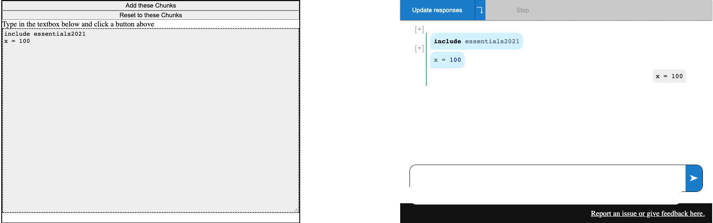

# Demo of Embedding Repartee

This is a demo of embedding Parley/Repartee in another page and controlling it
programmatically.

To run, you need to start a web browser (e.g. python3 -m http.server) in the
main directory – the webworker will not load from a `file:///` url. Then load
`example.html`. It should look like this:



The current interface is:

```
window.embedableParley.renderParley :: HTMLElement -> Parley

    Takes an HTML element and renders the React Parley element inside it.
    Returns an instance of the Parley interface

type Parley :: {
    // adds a single chunk at the end (doesn't run)
    addChunk :: string => void

    // changes all chunks to be the given list of strings in order (doesn't run)
    resetChunks :: string[] => void

    // rerun chunks
    run :: () => void 
}
```

See `example.html` for how the demo page is set up.